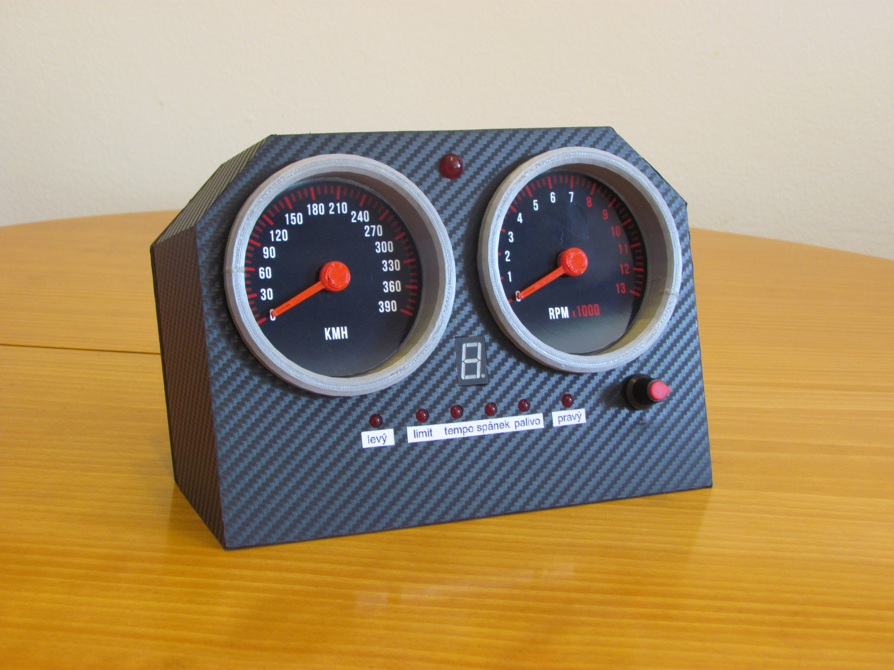

# Sim dashboard app

Simple manager app for Arduino-powered car dashboard for sim racing games. It continuously collects data from games' shared memory, processes them and sends them to Arduino via USB.

The Arduino then controls servos, LEDs, displays and so on based on that recieved data.

## Note

This app is very old and even by the time of writing it, it was mainly experiment to try to connect game world with physical world in fun way.